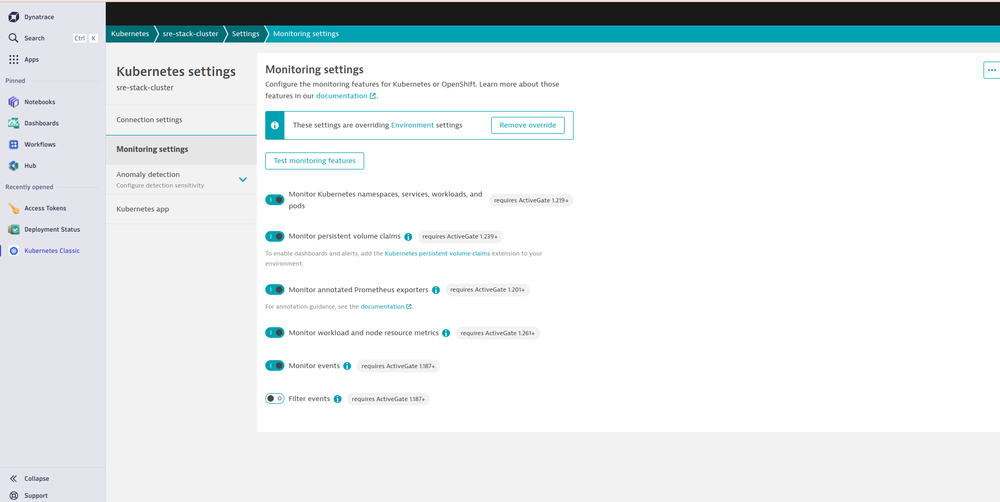

Install causely 

```
causely auth login
causely agent install --cluster-name sre-stack --values compare/causely-default-values.yaml
```


### Install Dynatrace 


Create token with these scopes:

- activeGateTokenManagement.create 
- entities.read 
- settings.read 
- settings.write 
- metrics.ingest
- DataExport 
- InstallerDownload


```
aws eks create-addon --cluster-name sre-stack --addon-name dynatrace_dynatrace-operator --addon-version v0.14.2-eksbuild.1 --region us-west-2

kubectl -n dynatrace create secret generic dynakube --from-literal="apiToken=<token>" --from-literal="dataIngestToken=<token>"

kubectl apply -f compare/dynakube-k8s-csi.yaml
```

Make sure `spec.apiUrl` is set with your account id e.g `https://<account_id>.live.dynatrace.com/api`

```
kubectl apply -f compare/dynakube.yaml
```

Enable Istio metric ingest

Do it after robot-shop is deployed

```
kubectl annotate --overwrite service istiod -n istio-system \
metrics.dynatrace.com/port='15014' metrics.dynatrace.com/scrape='true'

kubectl annotate --overwrite service --all -n robot-shop \
metrics.dynatrace.com/port='15020' metrics.dynatrace.com/scrape='true' \
metrics.dynatrace.com/path="/stats/prometheus" \
metrics.dynatrace.com/filter='{
    "mode": "include",
    "names": [
      "istio_requests_total",
      "istio_tcp_received_bytes_total",
      "istio_tcp_sent_bytes_total",
      "istio_tcp_connections_closed_total",
      "istio_tcp_connections_opened_total",
      "istio_request_duration_milliseconds",
      "pilot_k8s_cfg_events"
    ]
  }'
```

Finally, add services to scrape Prometheus and rabbitmq metrics.

```
kubectl apply -f compare/prom-svc.yaml
```

Enable all these options under Kubernetes Classic and select the settings for your cluster.



Enable Extension Execution Controller configuration for OneAgent deployment

